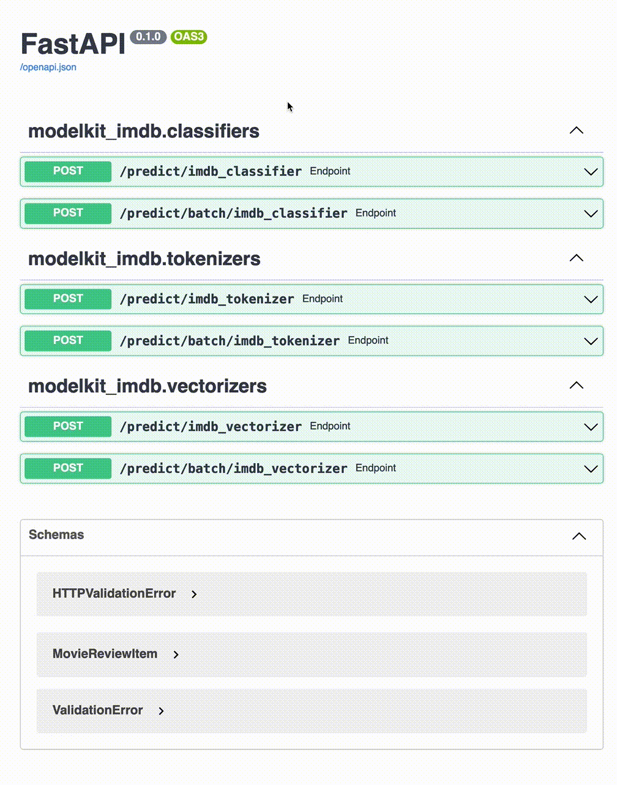

<p align="center">
  <a href="https://github.com/clustree/modelkit">
    
</a><span style="font-size:30px; margin: 0px 20px 0px 10px; padding-bottom: 100px">x</span>

</p>

<h1 align="center">How to deploy a NLP pipeline</h1>
<h3 align="center">leveraging <a href="https://github.com/clustree/modelkit">modelkit</a> and the IMDB reviews dataset</h3>

<h4 align="center">
  <em>Features Covered: Installation, Project Organization, Assets Management, CLIs, REST API Serving</em>
</h4>

---

<p align="center">
  <a href="https://github.com/clustree/modelkit-imdb/actions?query=branch%3Amain+"></a>
  <a href="https://github.com/clustree/modelkit-imdb/actions/workflows/main.yml?query=branch%3Amain+"></a>
  <a href="https://clustree.github.io/modelkit-imdb/coverage/index.html"></a>

  <a href="https://github.com/clustree/modelkit-imdb/blob/main/LICENSE"></a>
</p>

This sample project aims at illustrating modelkit's powerful features, based on the documentation tutorial: [NLP x Sentiment Analysis](https://clustree.github.io/modelkit/examples/nlp_sentiment/intro.html).

It also serves as a sandbox for any developer willing to try out modelkit in _real conditions_, from the package organization to the Github CI and through the use of CLIs and HTTP serving.

## TL;DR

Jump to the result hosted on `Heroku` at https://modelkit-imdb.herokuapp.com/docs/.

## Installation

First, please `source .env` or run the following:

```bash
export MODELKIT_ASSETS_DIR=.local_storage
export MODELKIT_STORAGE_BUCKET=.
export MODELKIT_STORAGE_PREFIX=.remote_storage
export MODELKIT_STORAGE_PROVIDER=local
export MODELKIT_DEFAULT_PACKAGE=modelkit_imdb  # shortcut for CLIs
```

Once done, let's create a new python virtual environment and install the dev requirements:

```bash
pip install -r requirements-dev.txt
```

## Models listing

Before going further, let's remind us of the models that are available in the `modelkit_imdb` package with the following CLI:

```bash
modelkit describe
```


## Project Organization

modelkit encourages you to organize your project as a python package to benefit from the python software tools and clearness.

Hence, this sample project was first arranged following this minimal python package structure:
```
modelkit-imdb  # project directory
├── modelkit_imdb  # the python package name
│   ├── __init__.py  # the different models implemented
│   ├── classifiers.py
│   ├── tokenizers.py
│   └── vectorizers.py
├── requirements.txt
├── setup.cfg  # setup configurations for our package
├── setup.py
└── tests  # tests outside the modelkit_imdb package
    ├── __init__.py
    ├── conftest.py
    └── test_auto_testing.py
```

This way, your package can easily be shared and set up across your organization using pip, via an artifactory or git:
```
pip install git+https://github.com/clustree/modelkit-imdb.git                                                                                   10:41:07 
```

Before using it as a regular python package, with modelkit's support:
```python
import modelkit_imdb

from modelkit import ModelLibrary

 # use the ModelLibrary to automatically discover and load models from modelkit_imdb

library = ModelLibrary(models=modelkit_imdb)
tokenizer = library.get("imdb_tokenizer")
tokenizer.predict("I love this movie!")
```

In addition to this minimal python package structure, several files were also added for deployment and the github CI:
- `Dockerfile`& `heroku.yml`: to automatically deploy on Heroku after on the `main` branch once tests pass
- `Makefile`: to remind us how to lint, test or compute the coverage rate
- `.gitignore`: to prevent from versioning non-wanted files
- `noxfile.py`: to tests on multiple python environment, useful for the CI
- etc.

You are now all set to write your machine learning models following software engineering's and modelkit's best practices.

## Assets Management

For this sample project, we emulated a remote storage locally at `.remote_storage`, which contains all the differet artefacts created so far:
- `vocabulary.txt`, for the `imdb_vectorizer`
- `model.h5`: for the `imdb_classifier` 

In production, you may be using / want to use `AWS S3`, `GCS` or whatever (safely) configured remote storage: modelkit has your back and provides driver to directly read and write on those providers (you can also write your own!).

When using a model, modelkit automatically retrieves its different assets _from_ the remote storage, and safely caches _to_ a local storage.

To better understand how it all works, (modelkit's versioning and Assets Management), let's restart from scratch.

Make sure the `.env` file was sourced to set the environment variables needed by modelkit.

First, let's grab the different assets from the current local storage before dropping it as well as the remote storage:

```
mkdir -p tmp/classifier tmp/vectorizer
cp .local_storage/imdb/classifier/0.0/model.h5 tmp/classifier
cp .local_storage/imdb/vectorizer/0.0/vocabulary.txt tmp/vectorizer
rm -rf .local_storage/imdb .local_storage/.cache .remote_storage/imdb .remote_storage/.cache
```

Now, let's use `modelkit` assets management CLI to version our two assets along with their directories, under the `imdb` namespace:
```
# modelkit assets new [PATH] [NAMESPACE/NAME] 

modelkit assets new tmp/vectorizer imdb/vectorizer

# Current assets manager:
#  - storage provider = `<LocalStorageDriver bucket=.>`
#  - bucket = `.`
#  - prefix = `.remote_storage`
# Current asset: `imdb/vectorizer`
#  - name = `imdb/vectorizer`
# Push a new asset `imdb/vectorizer` with version `0.0`?
# [y/N]: y
```

```
modelkit assets new tmp/classifier imdb/classifier
# ...
```

The just-versioned assets are now located under the `.remote_storage` directory, along with their version and metadata.

They now can be used as part of modelkit models, in the `CONFIGURATIONS` map:

```python
class Classifier(modelkit.Model[MovieReviewItem, MovieSentimentItem]):
    CONFIGURATIONS = {
        "imdb_classifier": {
            "asset": "imdb/classifier:0.0[/model.h5]",  # namespace/name:version[subfile]
            "model_dependencies": {
                "tokenizer": "imdb_tokenizer",
                "vectorizer": "imdb_vectorizer",
            },
        }
    }
```

As you can see, they are *pinned* to a given version so that you can freely update them hurting production:

```
modelkit assets update tmp/classifier imdb/classifier

# Current assets manager:
#  - storage provider = `<LocalStorageDriver bucket=.>`
#  - bucket = `.`
#  - prefix = `.remote_storage`
# Current asset: `imdb/classifier`
#  - name = `imdb/classifier`
#  - major version = `None`
#  - minor version (ignored) = `None`
# Found a total of 1 versions (1 major versions) for `imdb/classifier`
#  - major `0` = 0.0
# Push a new asset version `0.1` for `imdb/classifier`?
# [y/N]: 
```

They are then retrieved and cached in `.local_storage` once called by at a model:

```python
from modelkit import ModelLibrary

lib = ModelLibrary(models="modelkit_imdb")  # package or path to the package
classifier = lib.get("imdb_classifier")
classifier.predict({"text": "I love this movie so much"})
# MovieSentimentItem(label='good', score=0.6999041438102722)
```

That's it, make sure to clean the `./tmp` folder before leaving!

## Tests

Let's make sure everything works as intended by running some tests.
```python
pytest
```

As you can see in the `tests/`subfolder, two things were added:
- in `conftest.py`: a pytest fixture `model_library` which creates a `ModelLibrary` with all the models found in the package
```python
from modelkit.testing.fixtures import modellibrary_fixture

modellibrary_fixture(
    models=modelkit_imdb,
    fixture_name="model_library",
)
```
- in `test_auto_testing.py`: a test which iterates through all `modelkit_imdb` models to find tests and run them, using the just-defined `model_library` fixture:
```python
from modelkit.testing import modellibrary_auto_test

modellibrary_auto_test(
    models=modelkit_imdb,
    fixture_name="model_library"
)
```

For more info, head over to [Testing](https://clustree.github.io/modelkit/library/models/testing.html).

## HTTP serving

The following CLI will start a single worker which will expose all the models found under the `modelkit_imdb` package leveraging [uvicorn](https://www.uvicorn.org/) and [FastAPI](https://fastapi.tiangolo.com/):

```bash
modelkit serve
```

Voilà: the [uvicorn](https://www.uvicorn.org/) worker is now running at `http://localhost:8000`.

modelkit also provides out-of-the-box support for [gunicorn](https://docs.gunicorn.org/en/stable/):
```bash
gunicorn --workers 4 \
         --bind 0.0.0.0:8000 \
         --preload \
         --worker-class=uvicorn.workers.UvicornWorker \
         'modelkit.api:create_modelkit_app()'
```

Check out the generated `SwaggerUI` at http://localhost:8000/docs to see all the endpoints and try them out:



Of course, you can also `POST` your request on the endpoint of your choice:

```bash
curl -X 'POST' \
  'http://localhost:8000/predict/imdb_classifier' \
  -H 'accept: application/json' \
  -H 'Content-Type: application/json' \
  -d '{
  "text": "This movie sucks! It is the worst I have ever seen in my entire life"
}'
# {"label":"bad","score": 0.1530771553516388}
```

## Deployment example

To conclude this sample project, a minimal `Dockerfile` was written as well as a `heroku.yml` file so that to host our different models on `Heroku` at https://modelkit-imdb.herokuapp.com/docs/.

You can run it locally using [Docker](https://www.docker.com/) and enjoy the Swagger at: http://localhost:8000/docs:

```bash
docker build -t modelkit-imdb .
docker run -p 8000:8000 -e PORT=8000 modelkit-imdb 
```
